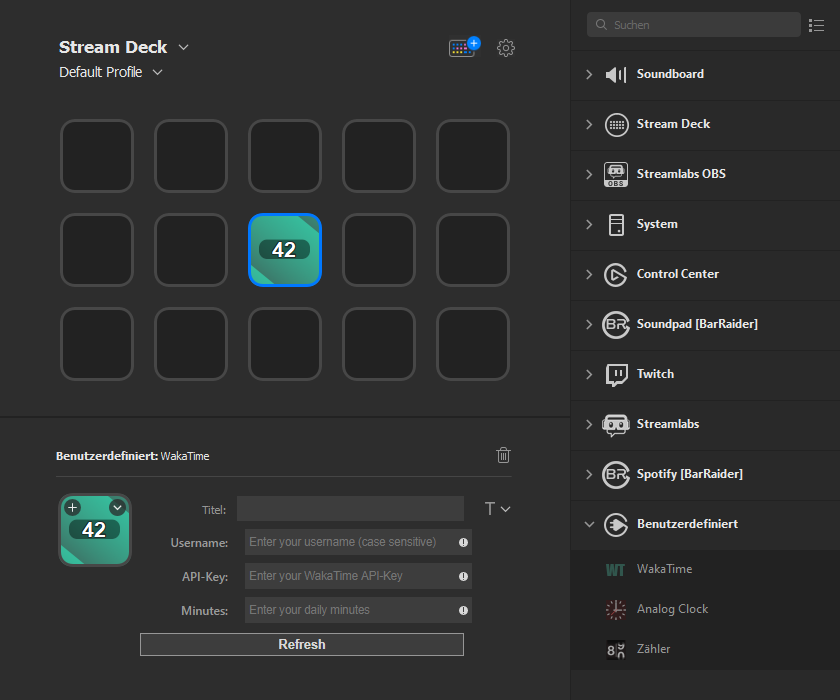

# streamdeck-wakatime

This plugin will show you how many minutes you have left to code for today. It fetches the API every 30 seconds due to
rounding.

## Installation

In the Release folder, you can find the file com.distrust.wakatime.streamDeckPlugin. If you double-click this file on
your machine, Stream Deck will install the plugin. Please note that this plugin is still in development.

## Setup

To use this plugin you need to open up the PropertyInspector and input

* Your WakaTime-Username
* Your [API-Key](https://wakatime.com/api-key)
* Your target daily minutes

After that hit the `Refresh` Button to persist the data in the global settings.

### Note

It may occur that one minute not always passes exactly when one realtime minute passes. This is because
your `IDE-Plugin` only updates in certain intervals or rounding leads to small mistakes.

## Licenses

### Source code

The code in this repository falls under
the [MIT-License](https://github.com/distrustME/streamdeck-wakatime/blob/master/LICENSE).

### Assets

* [Streamdeck Template](https://github.com/elgatosf/streamdeck-plugintemplate)
* [Developer Documentation](https://developer.elgato.com/documentation/stream-deck/sdk/overview/)
